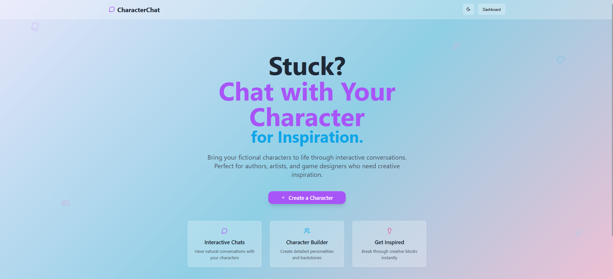
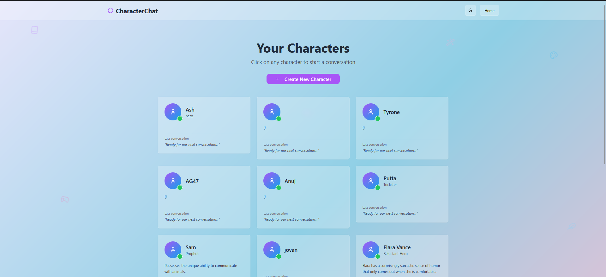
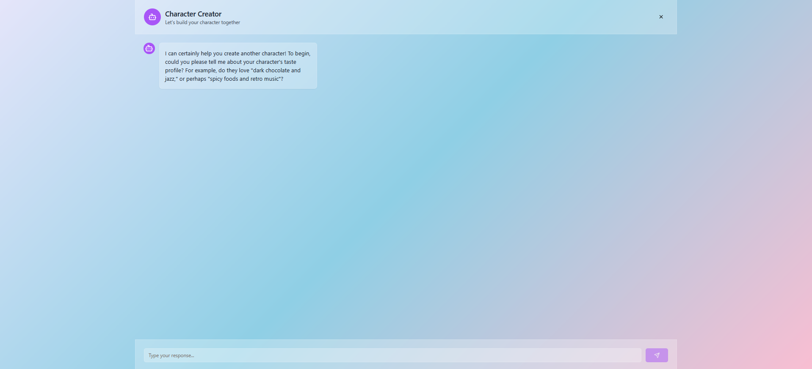
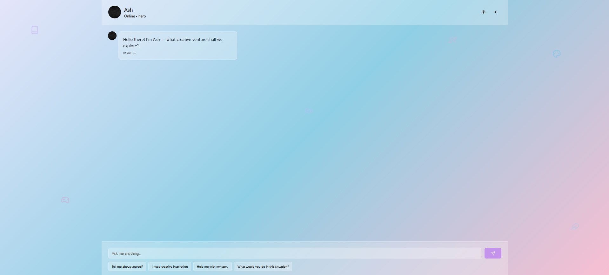
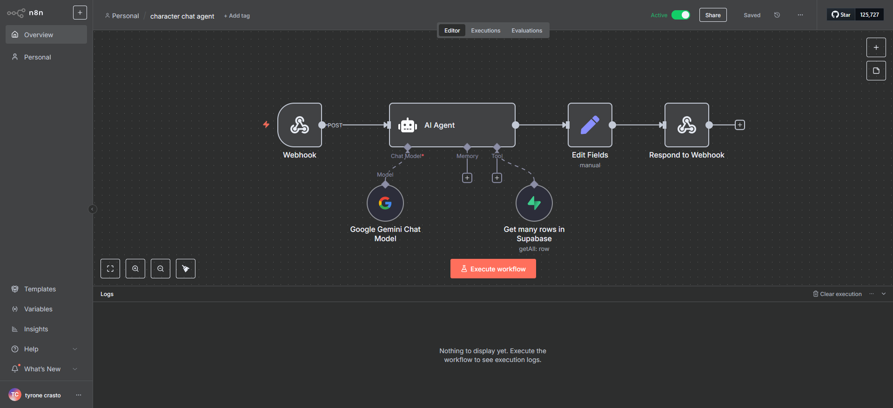
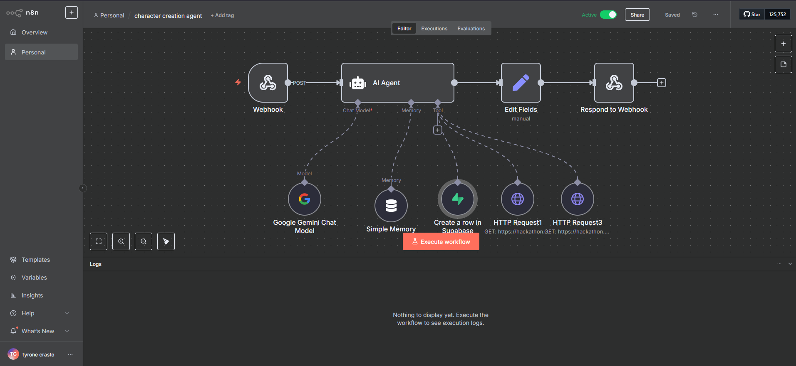
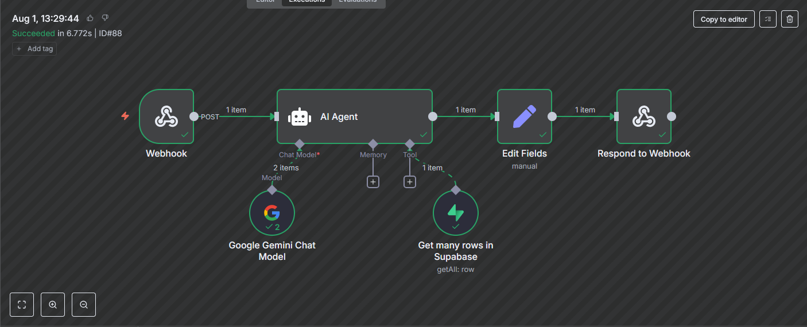
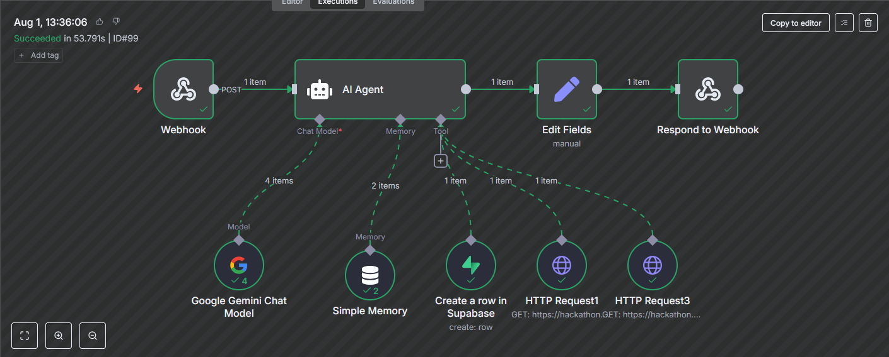

<!-- Improved compatibility of back to top link: See: https://github.com/othneildrew/Best-README-Template/pull/73 -->
<a id="readme-top"></a>

<!-- PROJECT SHIELDS -->
[![Contributors][contributors-shield]][contributors-url]
[![Forks][forks-shield]][forks-url]
[![Stargazers][stars-shield]][stars-url]
[![Issues][issues-shield]][issues-url]
[![MIT License][license-shield]][license-url]
[![LinkedIn][linkedin-shield]][linkedin-url]

<!-- PROJECT LOGO -->
<br />
<div align="center">
  <a href="https://github.com/706ash/Qloo-Hacakthon">
    
  </a>

  <h3 align="center">CharacterChat</h3>

  <p align="center">
    Bring Your Characters to Life Through AI Conversations
    <br />
    <a href="https://github.com/706ash/Qloo-Hacakthon"><strong>Explore the docs »</strong></a>
    <br />
    <br />
    <a href="https://github.com/706ash/Qloo-Hacakthon">View Demo</a>
    &middot;
    <a href="https://github.com/706ash/Qloo-Hacakthon/issues/new?labels=bug&template=bug-report---.md">Report Bug</a>
    &middot;
    <a href="https://github.com/706ash/Qloo-Hacakthon/issues/new?labels=enhancement&template=feature-request---.md">Request Feature</a>
  </p>
</div>

<!-- TABLE OF CONTENTS -->
<details>
  <summary>Table of Contents</summary>
  <ol>
    <li>
      <a href="#about-the-project">About The Project</a>
      <ul>
        <li><a href="#built-with">Built With</a></li>
      </ul>
    </li>
    <li>
      <a href="#screenshots--features">Screenshots & Features</a>
      <ul>
        <li><a href="#frontend-features">Frontend Features</a></li>
        <li><a href="#backend-automation">Backend Automation</a></li>
      </ul>
    </li>
    <li>
      <a href="#getting-started">Getting Started</a>
      <ul>
        <li><a href="#prerequisites">Prerequisites</a></li>
        <li><a href="#installation">Installation</a></li>
      </ul>
    </li>
    <li><a href="#usage">Usage</a></li>
    <li><a href="#system-architecture">System Architecture</a></li>
    <li><a href="#roadmap">Roadmap</a></li>
    <li><a href="#contributing">Contributing</a></li>
    <li><a href="#license">License</a></li>
    <li><a href="#contact">Contact</a></li>
    <li><a href="#acknowledgments">Acknowledgments</a></li>
  </ol>
</details>

<!-- ABOUT THE PROJECT -->
## About The Project

[![CharacterChat Landing Page][product-screenshot]](https://github.com/706ash/Qloo-Hacakthon)

CharacterChat is a full-stack web application that allows users to create and interact with custom AI characters through chat conversations. The application features a React frontend with a Node.js/Express backend, utilizing Supabase for data persistence through Drizzle ORM.

**Key Features:**
* **AI-Powered Character Creation**: Natural language processing for character development
* **Interactive Chat System**: Real-time conversations with personality-driven responses
* **Modern UI/UX**: Beautiful gradient design with glass morphism effects
* **Backend Automation**: n8n workflows for complex AI processing
* **Scalable Database**: Supabase PostgreSQL with comprehensive character data models
* **Creative Inspiration**: Perfect for authors, artists, and game designers

<p align="right">(<a href="#readme-top">back to top</a>)</p>

### Built With

This section should list any major frameworks/libraries used to bootstrap your project.

* [![React][React.js]][React-url]
* [![TypeScript][TypeScript]][TypeScript-url]
* [![Node.js][Node.js]][Node.js-url]
* [![Express][Express.js]][Express-url]
* [![Supabase][Supabase]][Supabase-url]
* [![Tailwind CSS][Tailwind CSS]][Tailwind-url]
* [![Vite][Vite]][Vite-url]
* [![Drizzle ORM][Drizzle ORM]][Drizzle-url]

<p align="right">(<a href="#readme-top">back to top</a>)</p>

<!-- SCREENSHOTS & FEATURES -->
## Screenshots & Features

### Frontend Features

#### Landing Page - Creative Inspiration Hub


**Features showcased:**
- **Modern Gradient Design**: Beautiful blue-to-pink gradient background with subtle icon overlays
- **Clear Value Proposition**: "Stuck? Chat with Your Character for Inspiration"
- **Target Audience Focus**: Perfect for authors, artists, and game designers
- **Quick Action**: Prominent "+ Create a Character" button for immediate engagement
- **Feature Highlights**: Three key benefit cards explaining Interactive Chats, Character Builder, and Creative Inspiration

#### Character Dashboard - Character Management


**Features showcased:**
- **Character Grid Layout**: Clean, organized display of all created characters
- **Character Profiles**: Each character shows name, role, and conversation status
- **Online Status Indicators**: Green dots showing character availability
- **Easy Navigation**: Dark mode toggle and home navigation
- **Character Diversity**: Various character types (Hero, Trickster, Prophet, etc.)
- **Quick Access**: "Create New Character" button prominently displayed

#### Character Creator - AI-Powered Creation


**Features showcased:**
- **Conversational UI**: Natural chat-based character creation process
- **AI Guidance**: Intelligent prompts to help users define character traits
- **Taste Profile Integration**: Detailed character preferences (food, music, etc.)
- **User-Friendly Interface**: Clean chat interface with clear input areas
- **Step-by-Step Process**: Guided character development through conversation

#### Interactive Chat - Character Conversations


**Features showcased:**
- **Real-time Messaging**: Natural conversation flow with character responses
- **Character Personality**: Each character has unique voice and responses
- **Quick Prompts**: Suggested conversation starters for easy interaction
- **Status Indicators**: Online status and character role display
- **Responsive Design**: Clean, modern chat interface with intuitive controls
- **Creative Inspiration**: Characters designed to help with creative projects

### Backend Automation

#### 🔧 n8n Workflows

##### AI Agent Workflow - Character Chat Processing


**Backend Features showcased:**
- **Webhook Integration**: RESTful API endpoints for real-time character interactions
- **AI Agent Processing**: Central AI agent powered by Google Gemini Chat Model
- **Supabase Database Integration**: Complete character data storage with PostgreSQL backend
- **Memory Management**: Simple memory system for conversation context
- **HTTP Request Tools**: External API integrations for enhanced functionality
- **Response Processing**: Automated field editing and webhook responses

##### Character Creation Workflow - AI-Powered Generation


**Backend Features showcased:**
- **Conversational AI**: Natural language processing for character development
- **Multi-Tool Integration**: Multiple HTTP requests for comprehensive character building
- **Supabase Database Storage**: Automated character data persistence with full schema support
- **Memory Context**: Conversation history tracking for consistent character creation
- **Workflow Orchestration**: Complex multi-step character generation process
- **Real-time Processing**: Fast response times (6-53 seconds execution)

##### Character Chat Agent - Successful Execution


**Backend Features showcased:**
- **Successful Workflow Execution**: Character chat agent completed in 6.772 seconds
- **Real-time Processing**: Fast response times for character interactions
- **Execution Tracking**: Detailed logs showing successful completion (ID#88)
- **Performance Metrics**: Sub-10 second response times for optimal user experience
- **Error-Free Operation**: All workflow steps completed with green checkmarks
- **Scalable Architecture**: Handles concurrent character chat requests efficiently

##### Character Creation Agent - Successful Execution


**Backend Features showcased:**
- **Complex Workflow Success**: Character creation agent completed in 53.791 seconds
- **Multi-Step AI Processing**: 4 successful AI interactions for comprehensive character building
- **Memory Management**: 2 memory interactions for conversation context
- **Database Operations**: Successful Supabase integration for character storage
- **External API Integration**: Multiple HTTP requests for enhanced character development
- **Advanced Orchestration**: Complex multi-tool workflow with coordinated processing

### 📁 n8n Workflow Files

The backend automation workflows are available as JSON files for local deployment:

- **`n8n workflows/Character chat agent workflow.json`** - Main character interaction workflow
- **`n8n workflows/Character creation agent workflow.json`** - Character generation workflow

#### Local n8n Setup Instructions

To run these workflows locally:

1. **Install n8n**
   ```bash
   npm install n8n -g
   ```

2. **Start n8n**
   ```bash
   n8n start
   ```

3. **Import Workflows**
   - Open n8n in your browser (usually `http://localhost:5678`)
   - Go to "Workflows" → "Import from file"
   - Select the workflow JSON files from the `n8n workflows/` directory

4. **Configure Environment Variables**
   - Set up your Supabase connection string
   - Add your Google Gemini API key
   - Configure any other required API keys

5. **Activate Workflows**
   - Toggle the "Active" switch on each workflow
   - Test the webhook endpoints

**Note**: Make sure to update the webhook URLs and API credentials in the imported workflows to match your local setup.

<p align="right">(<a href="#readme-top">back to top</a>)</p>

<!-- GETTING STARTED -->
## Getting Started

This is an example of how you may give instructions on setting up your project locally.
To get a local copy up and running follow these simple example steps.

### Prerequisites

This is an example of how to list things you need to use the software and how to install them.
* npm
  ```sh
  npm install npm@latest -g
  ```
* Node.js (v18 or higher)
* Supabase account and project
* Google Gemini API key

### Installation

1. Clone the repo
   ```sh
   git clone https://github.com/706ash/Qloo-Hacakthon.git
   ```
2. Install NPM packages
   ```sh
   npm install
   ```
3. Set up environment variables
   ```sh
   cp .env.example .env
   ```
4. Configure your environment variables in `.env`
   ```js
   DATABASE_URL=your_supabase_connection_string
   GEMINI_API_KEY=your_gemini_api_key
   ```
5. Set up the database
   ```sh
   npm run db:push
   ```
6. Start the development server
   ```sh
   npm run dev
   ```

<p align="right">(<a href="#readme-top">back to top</a>)</p>

<!-- USAGE EXAMPLES -->
## Usage

CharacterChat is designed for creative professionals who need inspiration and character development tools.

**For Authors:**
- Create detailed character profiles with rich backstories
- Chat with characters to develop their personalities
- Get inspiration for plot development and character arcs

**For Game Designers:**
- Design NPCs with unique personalities and motivations
- Test character dialogue and interactions
- Develop character relationships and storylines

**For Artists:**
- Create character concepts with detailed personality traits
- Get inspiration for character designs and expressions
- Develop character backstories for artwork

_For more examples, please refer to the [Documentation](https://github.com/706ash/Qloo-Hacakthon)_

<p align="right">(<a href="#readme-top">back to top</a>)</p>

<!-- SYSTEM ARCHITECTURE -->
## System Architecture

### Frontend Architecture
- **Framework**: React 18 with TypeScript
- **Routing**: Wouter for client-side routing
- **State Management**: TanStack Query (React Query) for server state management
- **UI Framework**: Radix UI components with shadcn/ui design system
- **Styling**: Tailwind CSS with custom CSS variables for theming
- **Animations**: Framer Motion for smooth animations and transitions
- **Build Tool**: Vite for development and bundling

### Backend Architecture
- **Runtime**: Node.js with Express.js
- **Language**: TypeScript with ES modules
- **API Pattern**: RESTful API design
- **Development Server**: Custom Vite integration for hot module replacement
- **Request Handling**: Express middleware for JSON parsing, CORS, and request logging

### Database Architecture
- **Database**: Supabase (PostgreSQL-based cloud database)
- **ORM**: Drizzle ORM with schema-first approach
- **Migrations**: Drizzle Kit for database schema management
- **Schema Location**: Shared schema definitions in `/shared/schema.ts`

### Supabase Database Schema

#### Characters Table Structure
The application uses Supabase to store character data with the following schema:


**Key Features:**
- **Flexible JSON Storage**: `jsonb` fields allow for dynamic character attributes
- **Comprehensive Character Data**: Complete character profiles with personality, backstory, and preferences
- **Real-time Updates**: Automatic timestamp tracking for data changes
- **Scalable Architecture**: Supabase's PostgreSQL foundation ensures reliability and performance

### Key Components

#### Data Models
- **Characters**: Core entities with personality traits, backstory, goals, fears, and taste profiles
- **Conversations**: Message history associated with characters
- **Personality Traits**: Numeric scores for wisdom, mystery, kindness, charisma, adventure, and analytical traits
- **Taste Profiles**: JSON objects containing music, books, and movie preferences

#### Character Creation System
- **Interactive Wizard**: Step-by-step character creation with conversational UI
- **Personality Mapping**: Quantified personality traits that influence responses
- **Rich Backstories**: Comprehensive character backgrounds including origin, goals, and fears

#### Chat System
- **Real-time Messaging**: Character-user conversations with typewriter effects
- **Character Response Engine**: Rule-based response generation based on personality traits
- **Message Persistence**: Conversation history storage and retrieval

#### UI Components
- **Theme System**: Light/dark mode support with custom CSS variables
- **Responsive Design**: Mobile-first approach with glass morphism effects
- **Component Library**: Comprehensive set of reusable UI components based on Radix UI

### Data Flow

#### Character Creation Flow
1. User navigates to creation wizard
2. Step-by-step form collection of character attributes
3. Personality trait quantification through user responses
4. Character data validation using Zod schemas
5. API call to create character in database
6. Redirect to dashboard with new character displayed

#### Chat Interaction Flow
1. User selects character from dashboard
2. Character data and conversation history loaded via React Query
3. User submits message through chat interface
4. Client-side character response generation based on personality
5. Message pair stored in database
6. UI updates with typewriter animation for character response

#### Data Persistence Flow
1. All database operations go through Drizzle ORM
2. Schema validation using drizzle-zod integration
3. Type-safe database queries with TypeScript
4. Connection pooling handled by Supabase

### External Dependencies

#### Core Dependencies
- **React Ecosystem**: React 18, React DOM, React Query for state management
- **UI Framework**: Radix UI primitives, shadcn/ui components, Tailwind CSS
- **Database**: Drizzle ORM, Supabase, connect-pg-simple
- **Validation**: Zod for runtime type checking and schema validation
- **Animation**: Framer Motion for UI animations
- **Utilities**: date-fns for date handling, clsx for conditional styling

#### Development Dependencies
- **Build Tools**: Vite with React plugin, esbuild for production builds
- **TypeScript**: Full TypeScript support with strict configuration
- **Development Experience**: Hot module replacement, error overlays, source maps

### Deployment Strategy

#### Development Environment
- **Local Development**: Vite dev server with Express API integration
- **Hot Reloading**: Full-stack hot module replacement
- **Database**: Connection to remote Supabase via DATABASE_URL environment variable

#### Production Build
- **Frontend**: Vite build outputting to `dist/public`
- **Backend**: esbuild compilation to `dist/index.js`
- **Deployment**: Single Node.js server serving both API and static files
- **Environment**: Production mode detection and optimization

#### Database Management
- **Schema Deployment**: `npm run db:push` for schema updates
- **Migrations**: Drizzle Kit generates and manages SQL migrations
- **Connection**: Supabase PostgreSQL optimized for edge deployment

<p align="right">(<a href="#readme-top">back to top</a>)</p>

<!-- ROADMAP -->
## Roadmap

- [x] Character Creation System
- [x] Interactive Chat Interface
- [x] AI-Powered Character Responses
- [x] Supabase Database Integration
- [x] n8n Workflow Automation
- [x] Modern UI/UX Design
- [ ] Multi-language Support
- [ ] Character Templates Library
- [ ] Advanced AI Models Integration
- [ ] Mobile Application
- [ ] Collaborative Character Creation
- [ ] Export/Import Character Data

See the [open issues](https://github.com/706ash/Qloo-Hacakthon/issues) for a full list of proposed features (and known issues).

<p align="right">(<a href="#readme-top">back to top</a>)</p>

<!-- CONTRIBUTING -->
## Contributing

Contributions are what make the open source community such an amazing place to learn, inspire, and create. Any contributions you make are **greatly appreciated**.

If you have a suggestion that would make this better, please fork the repo and create a pull request. You can also simply open an issue with the tag "enhancement".
Don't forget to give the project a star! Thanks again!

1. Fork the Project
2. Create your Feature Branch (`git checkout -b feature/AmazingFeature`)
3. Commit your Changes (`git commit -m 'Add some AmazingFeature'`)
4. Push to the Branch (`git push origin feature/AmazingFeature`)
5. Open a Pull Request

### Top contributors:

<a href="https://github.com/706ash/Qloo-Hacakthon/graphs/contributors">
  
</a>

<p align="right">(<a href="#readme-top">back to top</a>)</p>

<!-- LICENSE -->
## License

Distributed under the MIT License. See `LICENSE.txt` for more information.

<p align="right">(<a href="#readme-top">back to top</a>)</p>

<!-- CONTACT -->
## Contact

Tyrone Crasto - [@tyrone_crasto](https://twitter.com/tyrone_crasto) - tyrone.crasto@example.com

Project Link: [https://github.com/706ash/Qloo-Hacakthon](https://github.com/706ash/Qloo-Hacakthon)

<p align="right">(<a href="#readme-top">back to top</a>)</p>

<!-- ACKNOWLEDGMENTS -->
## Acknowledgments

Use this space to list resources you find helpful and would like to give credit to. I've included a few of my favorites to kick things off!

* [Choose an Open Source License](https://choosealicense.com)
* [GitHub Emoji Cheat Sheet](https://www.webpagefx.com/tools/emoji-cheat-sheet)
* [Malven's Flexbox Cheatsheet](https://flexbox.malven.co/)
* [Malven's Grid Cheatsheet](https://grid.malven.co/)
* [Img Shields](https://shields.io)
* [GitHub Pages](https://pages.github.com)
* [Font Awesome](https://fontawesome.com)
* [React Icons](https://react-icons.github.io/react-icons/search)
* [Supabase](https://supabase.com)
* [n8n](https://n8n.io)
* [Google Gemini](https://ai.google.dev/gemini)
* [Drizzle ORM](https://orm.drizzle.team)
* [shadcn/ui](https://ui.shadcn.com)

<p align="right">(<a href="#readme-top">back to top</a>)</p>

<!-- MARKDOWN LINKS & IMAGES -->
<!-- https://www.markdownguide.org/basic-syntax/#reference-style-links -->
[contributors-shield]: https://img.shields.io/github/contributors/706ash/Qloo-Hacakthon.svg?style=for-the-badge
[contributors-url]: https://github.com/706ash/Qloo-Hacakthon/graphs/contributors
[forks-shield]: https://img.shields.io/github/forks/706ash/Qloo-Hacakthon.svg?style=for-the-badge
[forks-url]: https://github.com/706ash/Qloo-Hacakthon/network/members
[stars-shield]: https://img.shields.io/github/stars/706ash/Qloo-Hacakthon.svg?style=for-the-badge
[stars-url]: https://github.com/706ash/Qloo-Hacakthon/stargazers
[issues-shield]: https://img.shields.io/github/issues/706ash/Qloo-Hacakthon.svg?style=for-the-badge
[issues-url]: https://github.com/706ash/Qloo-Hacakthon/issues
[license-shield]: https://img.shields.io/github/license/706ash/Qloo-Hacakthon.svg?style=for-the-badge
[license-url]: https://github.com/706ash/Qloo-Hacakthon/blob/master/LICENSE.txt
[linkedin-shield]: https://img.shields.io/badge/-LinkedIn-black.svg?style=for-the-badge&logo=linkedin&colorB=555
[linkedin-url]: www.linkedin.com/in/ashden-mascarenhas-815b50253
[linkedin-url]: www.linkedin.com/in/ashden-mascarenhas-815b50253
[product-screenshot]: screenshots/landing-page.png
[React.js]: https://img.shields.io/badge/React-20232A?style=for-the-badge&logo=react&logoColor=61DAFB
[React-url]: https://reactjs.org/
[TypeScript]: https://img.shields.io/badge/TypeScript-007ACC?style=for-the-badge&logo=typescript&logoColor=white
[TypeScript-url]: https://www.typescriptlang.org/
[Node.js]: https://img.shields.io/badge/Node.js-43853D?style=for-the-badge&logo=node.js&logoColor=white
[Node.js-url]: https://nodejs.org/
[Express.js]: https://img.shields.io/badge/Express.js-404D59?style=for-the-badge
[Express-url]: https://expressjs.com/
[Supabase]: https://img.shields.io/badge/Supabase-3ECF8E?style=for-the-badge&logo=supabase&logoColor=white
[Supabase-url]: https://supabase.com/
[Tailwind CSS]: https://img.shields.io/badge/Tailwind_CSS-38B2AC?style=for-the-badge&logo=tailwind-css&logoColor=white
[Tailwind-url]: https://tailwindcss.com/
[Vite]: https://img.shields.io/badge/Vite-646CFF?style=for-the-badge&logo=vite&logoColor=white
[Vite-url]: https://vitejs.dev/
[Drizzle ORM]: https://img.shields.io/badge/Drizzle_ORM-FF6B6B?style=for-the-badge&logo=drizzle&logoColor=white
[Drizzle-url]: https://orm.drizzle.team/
